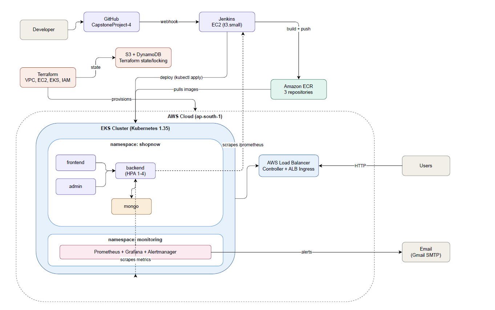

# StackedPages — End-to-End AWS DevOps Pipeline (Capstone Project)

A production-style CI/CD pipeline that builds, tests, deploys, and monitors a 3-tier bookstore e-commerce application (StackedPages) on AWS EKS. Built as a hands-on capstone covering Terraform, Jenkins, Docker, Kubernetes, and Prometheus/Grafana.

> **Note on naming:** the application is branded StackedPages, but the underlying Kubernetes namespace, ECR repository naming, and ingress resource names below still use the original `shopnow` identifier — these are infrastructure-level names left unchanged from the original scaffold, not a typo.



---

## What this project demonstrates

- Infrastructure provisioned entirely as code (Terraform), with remote state in S3 + DynamoDB locking
- A self-hosted Jenkins CI/CD server that builds Docker images, pushes to ECR, and deploys to EKS automatically on every `git push`
- A real application (React frontend, React admin dashboard, Express/MongoDB backend) — a bookstore storefront called StackedPages — running on Kubernetes behind an AWS Application Load Balancer
- Horizontal Pod Autoscaling based on live CPU metrics
- Full observability: Prometheus + Grafana dashboards, and email alerting tested end-to-end (alert fires → email arrives → alert resolves → resolution email arrives)
- No static AWS credentials anywhere — Jenkins authenticates purely via an IAM role attached to its EC2 instance

---

## Architecture

```
Developer → GitHub → (webhook) → Jenkins (EC2)
                                     │
                          build + push Docker images
                                     │
                                     ▼
                              Amazon ECR (3 repos)
                                     │
                            kubectl apply / rollout
                                     │
                                     ▼
                    ┌────────────────────────────────┐
                    │         EKS Cluster              │
                    │  ┌──────────────────────────┐   │
                    │  │  namespace: shopnow        │   │
                    │  │  frontend / admin / backend │   │
                    │  │  → mongo                    │   │
                    │  └──────────────────────────┘   │
                    │  ┌──────────────────────────┐   │
                    │  │  namespace: monitoring      │   │
                    │  │  Prometheus / Grafana /     │   │
                    │  │  Alertmanager               │   │
                    │  └──────────────────────────┘   │
                    └──────────────┬───────────────────┘
                                   │
                          AWS Load Balancer (ALB)
                                   │
                                   ▼
                                Users

Terraform provisions: VPC, EC2 (Jenkins), EKS cluster + node group,
IAM roles, S3/DynamoDB (state). State is never touched by Jenkins —
Terraform is run manually, per project scope (see "Scope decisions" below).
```

An editable version of this diagram (`.drawio`) is in `docs/shopnow-architecture.drawio` — open it at [app.diagrams.net](https://app.diagrams.net).

---

## Repository structure

```
.
├── backend/                    Express API + Mongoose models
├── frontend/                   React customer-facing app
├── admin/                      React admin dashboard
├── terraform/                  Infrastructure as Code
│   ├── provider.tf
│   ├── vpc.tf                  Jenkins VPC + public subnet
│   ├── eks-networking.tf       Secondary CIDR, EKS subnets, NAT gateway
│   ├── eks.tf                  EKS cluster + managed node group
│   ├── ec2.tf                  Jenkins EC2 instance
│   ├── iam.tf                  IAM roles/policies (Jenkins, EKS)
│   ├── security-group.tf
│   ├── key-pair.tf
│   ├── backend.tf              S3 remote state config
│   ├── variables.tf / terraform.tfvars
│   └── output.tf
├── k8s/
│   ├── namespace/               shopnow namespace
│   ├── mongo/                   MongoDB Deployment + Service
│   ├── backend/                 Backend Deployment + Service (+ resource limits)
│   ├── frontend/                Frontend Deployment + Service
│   ├── admin/                   Admin Deployment + Service
│   ├── ingress/                 ALB Ingress (path routing: /, /admin, /api)
│   ├── hpa/                     HorizontalPodAutoscaler (backend)
│   └── monitoring/
│       ├── grafana-ingress.yaml
│       ├── alert-rules.yaml     Custom PrometheusRule (deployment health, CPU, Jenkins)
│       └── dashboards/          Grafana dashboards as ConfigMaps (persist across restarts)
├── Jenkinsfile                  CI/CD pipeline definition
├── docs/
│   ├── screenshots/             Evidence screenshots (see below)
│   └── shopnow-architecture.drawio
├── README.md                    This file
├── TESTING.md                   Test cases and verification steps
└── TROUBLESHOOTING.md            Real issues hit during the build and how they were fixed
```

---

## Prerequisites

If you're forking this repo and want to reproduce the setup, you'll need:

| Tool | Purpose |
|---|---|
| AWS account with billing enabled | EC2, EKS, ECR, VPC, IAM, S3 all incur cost |
| AWS CLI v2, configured (`aws configure`) | Provisioning infra, ECR auth |
| Terraform >= 1.6 | Infrastructure provisioning |
| An SSH key pair (or let Terraform generate one — see below) | Access to the Jenkins EC2 instance |
| A GitHub account + Personal Access Token | Jenkins → GitHub integration |
| A Gmail account + App Password | Alertmanager email delivery (optional but recommended) |

**Estimated AWS cost while running**: roughly $2–4/day (EKS control plane, 2× t3.small nodes, NAT Gateway, ALB, Jenkins EC2). See "Cost management" below for how to reduce this.

---

## Setup — from a fresh fork

### 1. Fork and clone

```bash
git clone https://github.com/<your-username>/stackedPages-cloud-native.git
cd stackedPages-cloud-native
```

### 2. Provision the Jenkins server and base networking

```bash
cd terraform
terraform init
terraform plan
terraform apply -auto-approve
```

This creates: a VPC with a public subnet, a security group (SSH + Jenkins UI open), an SSH key pair (Terraform-generated, saved locally as `<project_name>-key.pem`), and the Jenkins EC2 instance.

Get the instance's public IP:
```bash
terraform output jenkins_public_ip
```

### 3. Install Jenkins, Docker, AWS CLI, and kubectl on the instance

SSH in and install manually (see `TROUBLESHOOTING.md` for the exact commands and the issues we hit — Java version, GPG key rotation, etc.):

```bash
ssh -i <project_name>-key.pem ubuntu@<jenkins_public_ip>
```

Install, in order: Java 21, Jenkins (via the current `pkg.jenkins.io` key), Docker, AWS CLI v2, kubectl, Terraform, Helm, eksctl.

### 4. Provision the EKS cluster

Back in the `terraform/` directory (from your local machine or the EC2 instance):

```bash
terraform apply -auto-approve
```

This adds a secondary VPC CIDR, EKS-specific public/private subnets, a NAT Gateway, the EKS cluster, and a 2-node managed node group. Takes roughly 15–20 minutes.

```bash
aws eks update-kubeconfig --name <cluster_name> --region <region>
kubectl get nodes
```

### 5. Set up the AWS Load Balancer Controller (needed for Ingress)

```bash
eksctl utils associate-iam-oidc-provider --cluster <cluster_name> --region <region> --approve
curl -o iam_policy.json https://raw.githubusercontent.com/kubernetes-sigs/aws-load-balancer-controller/v2.9.0/docs/install/iam_policy.json
aws iam create-policy --policy-name AWSLoadBalancerControllerIAMPolicy --policy-document file://iam_policy.json
eksctl create iamserviceaccount --cluster=<cluster_name> --namespace=kube-system --name=aws-load-balancer-controller --attach-policy-arn=arn:aws:iam::<account-id>:policy/AWSLoadBalancerControllerIAMPolicy --approve
helm repo add eks https://aws.github.io/eks-charts
helm install aws-load-balancer-controller eks/aws-load-balancer-controller -n kube-system --set clusterName=<cluster_name> --set serviceAccount.create=false --set serviceAccount.name=aws-load-balancer-controller --set vpcId=<vpc_id>
```

### 6. Create ECR repositories

```bash
aws ecr create-repository --repository-name <your-name>-shopnow/backend --region <region>
aws ecr create-repository --repository-name <your-name>-shopnow/frontend --region <region>
aws ecr create-repository --repository-name <your-name>-shopnow/admin --region <region>
```

### 7. Configure Jenkins

- Unlock Jenkins, install suggested plugins plus: Docker, Docker Pipeline, Kubernetes, Kubernetes CLI, AWS Credentials, Pipeline: AWS Steps, Amazon ECR
- Add a GitHub Personal Access Token as a Jenkins credential (`github-creds`)
- Create a Pipeline job pointing at this repo, branch `main`, script path `Jenkinsfile`
- Enable **GitHub hook trigger for GITScm polling**
- Add a webhook in your GitHub repo settings: `http://<jenkins_public_ip>:8080/github-webhook/`

Update the image names, cluster name, and region in `Jenkinsfile`'s `environment` block to match your account.

### 8. Push to trigger the pipeline

```bash
git commit --allow-empty -m "Trigger initial pipeline run"
git push origin main
```

Jenkins should build all 3 images, push to ECR, and deploy to EKS automatically.

### 9. Set up monitoring (optional but recommended)

```bash
helm repo add prometheus-community https://prometheus-community.github.io/helm-charts
kubectl create namespace monitoring
helm install prometheus prometheus-community/kube-prometheus-stack -n monitoring \
  --set grafana.adminPassword='<your-password>'
kubectl apply -f k8s/monitoring/
```

For email alerts, configure Alertmanager's SMTP settings — see `TROUBLESHOOTING.md` for the exact YAML and the gotchas we hit (a stray `"null"` receiver reference broke the whole config silently).

### 10. Access the application

```bash
kubectl get ingress -A
```

- Frontend: `http://<shopnow-ingress-address>/`
- Admin: `http://<shopnow-ingress-address>/admin/`
- Grafana: `http://<grafana-ingress-address>/`

---

## Cost management

EKS node groups, the NAT Gateway, and ALBs bill hourly. To pause without losing your setup:

```bash
kubectl delete ingress shopnow-ingress -n shopnow
kubectl delete ingress grafana-ingress -n monitoring
cd terraform
terraform destroy -target=aws_eks_node_group.main -auto-approve
terraform destroy -target=aws_nat_gateway.eks_nat -auto-approve
terraform destroy -target=aws_eip.eks_nat -auto-approve
```

To resume:
```bash
terraform apply -auto-approve
kubectl apply -f k8s/ingress/ingress.yaml
kubectl apply -f k8s/monitoring/grafana-ingress.yaml
```

---

## Further reading

- [`TESTING.md`](TESTING.md) — test cases covering application functionality, deployment integrity, and pipeline behavior

---

## License

See [`LICENSE`](LICENSE).